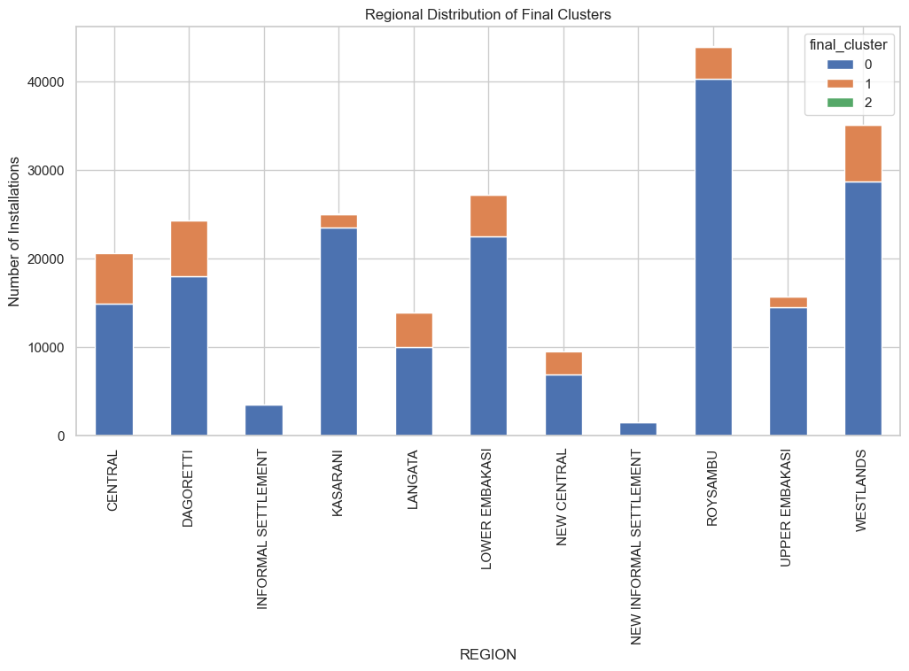

# **Nairobi Water Loss Analysis & Clustering**


```
🗂️ Repository Structure
├── Data/                # Raw and processed datasets (not uploaded here for privacy)
├── notebooks/           # Jupyter notebooks
│   ├── nairobi_water_loss.ipynb   # Main analysis & modeling notebook
├── README.md            # Project documentation (this file)
├── requirements.txt     # Python dependencies
```
⚙️ Setup Instructions
1️⃣ Clone the repository
``` bash
git clone https://github.com/Assesa44/nairobi-water-loss.git
cd nairobi-water-loss
```

2️⃣ Create and activate a virtual environment
``` bash
python -m venv venv
source venv/bin/activate      # On Mac/Linux
venv\Scripts\activate         # On Windows
```

3️⃣ Install dependencies
``` bash
pip install -r requirements.txt
```

``` bash
4️⃣ Launch Jupyter Notebook
jupyter notebook
```

Then open:

`notebooks/nairobi_water_loss.ipynb`

## **Business Understanding**
### **Background**
The Nairobi City Water and Sewerage Company (NCWSC), responsible for supplying clean and safe water to Nairobi residents, despite heavily investing in water infrastructure, struggles with non-revenue water (NRW), water that is produced but not billed due to physical losses (leakages, illegal connections) and commercial losses (meter inaccuracies, billing errors).

According to the Water Services Regulatory Board (WASREB), NCWSC loses nearly 50% of the water it produces. This situation leads to:
- Reduced revenue and financial instability.

- Inefficient use of already scarce water resources.

- Constraints on sustaining infrastructure improvements.

### **Project Overview**
This project analyzes water consumption and billing data from Nairobi to detect non-revenue water (NRW) and potential water losses. It focuses on applying clustering models such as K-Means and Gaussian Mixture Models (GMM) to segment consumers based on billing, sewer, and water usage, as well as applying predictive modeling to help predict which billing category a new customer falls into.

This project's ultimate goal is to support smart metering strategies and provide actionable insights to reduce water loss.

### **Stakeholders**
Some of the major stakeholders include;

- NCWSC Management & Operations Teams – oversee production, distribution, and billing; directly responsible for reducing non-revenue water.

- Policy Makers & Regulators (e.g., WASREB, Ministry of Water & Sanitation) – set compliance standards, monitor performance, and allocate resources.

- Nairobi City Planners & County Government – align water management with urban development plans.

- Customers – end-users who rely on the water supply and are directly affected by service reliability, pricing, and billing accuracy.

- Technical Partners/Vendors – providers of smart metering technology and IoT solutions.

- Donors/Investors – external organizations funding or supporting water infrastructure projects.

---

## **Data Understanding**
### **Data Source**
The data used in this project was sourced from [Nairobi Water and Sewerage Company](https://portal.nairobiwater.co.ke/), and it contains details on the company's customers water usage data for 10 months.

The data in question can be downloaded [here](https://docs.google.com/spreadsheets/d/1Q2YkviN5tng_tSRmRjXlnA0Q85ofu8Qy/edit?usp=drive_link&ouid=110570190886409143359&rtpof=true&sd=true).

---

## **Data Preparation**
We followed best practices to prepare the data:

### 1. **Cleaning**

* Handled missing values
* Converted records to their correct data types
* Dropped uninformative columns

### 2. **Encoding**

* Categorical variables with:

  * **OneHot Encoding** 

### 3. **Standardizing**

* Standardized our numeric columns 

### 4. **Dimension Reduction**

* Reduced the dimensions of some of the columns using `PCA`

---

## **Modeling**
We tested multiple models and tuned them iteratively:

### 1. **KMeans Clustering**

* Performed KMeans Clustering iteratively, using the elbow method to choose the best n_clusters, PCA to reduce dimensionality (performed well)

### 2. **Gaussian Model (GMM)**

* Performed GMM to effectively improve our model by adding probabilities to the outputs, selected the best model using;
   - BIC (Bayesian Information Criterion)
   - AIC (Akaike Information Criterion)

* Unfortunately, this model did not work as expected, so we dropped it.

### 3. **Predictive Modeling** 

* Applied predictive modeling to help predict which billing category a new customer falls into.

### Evaluation Metrics

* **Silhouette Score** - measures how similar an object is to its own cluster compared to other clusters

* **Calinski-Harabasz Index**- measures the ratio of between-cluster separation to within-cluster compactness

* **Davies-Bouldin Index** - measures the average similarity between each cluster and its most similar one

---

## **Evaluation**

### **Final Model Performance**
- `Silhouette Score= 0.8108`, this indicates that the clusters are very well-separated and internally consistent. Before PCA, our silhouette was 0.80, which clearly indicates that PCA has improved cohesion + separation dramatically.

- `Calinski-Harabasz Index= 199495.90`, the higher the index, the better separation between clusters relative to within-cluster variance. At first, this might look like a drop in “quality,” but  PCA reduced dimensionality, often lowers absolute CH values.

- `Davies-Bouldin Index= 0.5216`, the closer to 0 the index is, the better it is. This indicates that the clusters are compact and farther away from each other.

---

## **Deployment and Tableau dashboard**
The best model was deployed on Render here is the link -- ([Deployment link](https://water-loss-reduction-through-smart.onrender.com))

Here is the link to the Tableau dashboard -- ([Tableau dashboard](https://public.tableau.com/app/profile/leejay.mwakireti/viz/Water_Loss_Reduction_by_Smart_Metering/Dashboard1))

## **Insights & Recommendations**
This section outlines key findings from the analysis and offers actionable recommendations for stakeholders, particularly the NCWSC board.


### Key Insights
#### *Water Production, Usage, and Loss Trends*
C:\Users\Johny\Documents\moringa\phase4\project\water-loss-reduction-through-smart-metering\images\loss_trends.png


Between August 2024 and May 2025, the data showed a consistent gap between the volume of water produced and the volume that is ultimately billed to consumers. On average, production ranged between 15 and 19 million units per month, while billed consumption remained much lower, hovering around 10 million units. This gap translates into substantial losses, typically between 6 and 9 million units every month.

The overall picture suggests that, despite stable and at times rising production levels, more than 40 percent of the water produced is not being accounted for in revenue.

#### *Water Usage by Region*


Roysambu recorded the highest billed volume at over 19 million units, standing out as the single largest contributor. Westlands followed with nearly 14.3 million units, while Lower Embakasi and Dagoretti also reported substantial billed volumes, exceeding 12.5 million and 11.7 million units respectively.

In the mid-range, Central and Langata registered billed volumes of approximately 10.2 million and 9.5 million units, with Kasarani slightly lower at 8.5 million units. Upper Embakasi trailed further behind at around 6.4 million units.

The lowest billed volumes were concentrated in New Central, Informal Settlements, and New Informal Settlements, which recorded 4.7 million, 0.9 million, and 0.38 million units respectively

#### *Cluster Distribution*



##### *Interpretation by Cluster*

**Cluster 0**


`WATER_AMOUNT = 11,873.80`, `SEWER_AMOUNT = 6,965`, `BILL_AMOUNT = 18,840`, `BILL_VOLUME = 178.29`, and `METER_SIZE = 0.56`. By the look of cluster 0's profile, this looks like small users (households, small shops) characterized by:

- Very low consumption.

- Very small bills.

- Small meter sizes (~½ inch).

**Cluster 1**

`WATER_AMOUNT = 34,897.60`, `SEWER_AMOUNT = 52,082.63 `, `BILL_AMOUNT = 86,980.80`, `BILL_VOLUME = 960.01`, and `METER_SIZE = 2.02`. This looks like medium users (apartment blocks, schools, mid-sized businesses) characterized by:

- Moderate water usage.

- Medium-sized bills.

- Meter sizes ~2.02  inches.


**Cluster 2**

`WATER_AMOUNT = 3,345,803.48`, `SEWER_AMOUNT = 1,672,711.49`, `BILL_AMOUNT = 5,018,514.96`, `BILL_VOLUME = 50,188.26`, and `METER_SIZE = 6.35`. This cluster contains the big consumers (industries, large businesses, commercial entities) characterized by:

- Extremely high consumption.

- Very large bills.

- Meter sizes around 6.35 inches, which is huge.

This group likely contributes the majority of revenue.

### **Strategic Recommendations**
#### *Technical Recommendations*

1. Smart Meter Deployment Strategy

We recommend the company start with high-consumption or high-loss zones (e.g., industries, commercial consumers, or clusters with suspicious consumption patterns from the KMeans) by using a phased rollout (pilot → expansion → citywide coverage) to minimize cost and test efficiency.

2. Real-Time Monitoring & Alerts

Before installing the smart meters, ensure that the devices can send usage data hourly/daily and also trigger automatic alerts when they detect:

- Sudden spikes (possible leaks).

- Zero consumption over long periods (possible illegal connection).

- Continuous flow at odd hours (possible burst pipe).

#### *Operational Recommendations*

1. Data Analytics for NRW Reduction

The company should use the clustered customers to identify risk groups:

- Overlapping clusters → possible inconsistent billing.

- Outliers → possible illegal connections or faulty meters.

2. Use predictive models to estimate expected usage vs. actual to flag anomalies.

3. Proactive Maintenance

The company should also schedule field checks where smart meters report unusual patterns, replace faulty meters quickly (calibration drift = hidden NRW).

4. Automated Billing & Transparency

We recommend that the company should link the smart meters directly to billing systems. By doing this, the company reduces human interference in meter reading, curbing corruption & under-reporting.

#### *Policy & Governance Recommendations*

1. NRW Reduction Targets

The company should set targets (e.g., reduce NRW from 45% → 25% in 3 years), and regularly publish performance dashboards to track progress.

2. Public–Private Partnerships

We also recommend that the company partner with tech providers for cheaper smart meter solutions.

## **Conclusion**
This project applied KMeans Clustering to segment over 200,000 water consumers in Nairobi, with the goal of identifying consumption patterns and uncovering potential areas of Non-Revenue Water (NRW) losses.

The clustering revealed distinct consumer groups — from low-volume domestic users to high-volume industrial and commercial consumers — highlighting areas where water distribution inefficiencies and losses may be occurring.

By combining data-driven insights with recommendations for smart metering, real-time monitoring, and targeted policy interventions, this analysis provides a foundation for tackling one of the biggest challenges in Nairobi’s water supply: reducing NRW and ensuring sustainable water resource management.

The results demonstrate how machine learning can support utilities in making evidence-based decisions, optimizing resource allocation, and improving service delivery for millions of residents.

Future improvements may include integrating geospatial data, seasonal consumption trends, and real-time IoT sensor data to further enhance accuracy and impact.

##### **Tech Stack**

- Python

- Pandas, NumPy for data manipulation

- Matplotlib, Seaborn for visualization

- Scikit-learn for clustering & pipelines

- Jupyter Notebook for analysis


##### **How to Reproduce Results**

1. Open the notebook nairobi_water_loss.ipynb.

2. Run all cells in order.

The notebook will:

- Preprocess the data

- Apply clustering models

- Visualize clusters and report metrics

## **🤝 Contribution**

1. Fork the repo

Create a new branch: ```git checkout -b feature-name```

Commit your changes: ```git commit -m "Add new feature"```

Push to the branch: ```git push origin feature-name```

2. Submit a pull request

## **📄 License**

This project is licensed under the MIT License.
